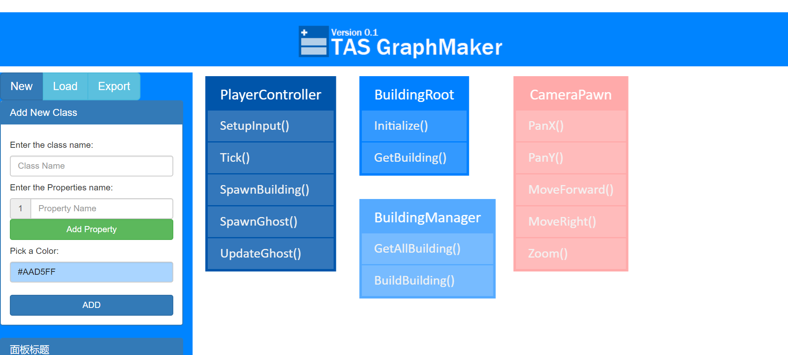

## Overview
A Simple Graph Maker can draw Classes in UML style

> Dependency

+ `Bootstrap` for layout and UI
+ `Konva` for graph painting
+ `Huebee` for color selection

> File Instructions

+ `test.js` is the Initialization of Konva Stages and Layers
+ `functionLib.js` is the functions used in the program
+ `DomOps` is the Jquery operations 
+ `index.html` is the main page in English
+ `index_CN.html` is the main page in Chinese

## view the Screenshot below!

## Features
> Now in Version 0.1,FEATRURS ARE:

+ Chinese/English index pages avaliable
+ Creating class through press ADD button
+ Can specify Class names, property names and theme color
+ Drag and drop the class graph
+ The movement of the graph is block-move
+ Can add multiple properties 
+ Class graph's height auto resize based on the increasment of properties
+ Class graph's width auto resize based on the test lengh
+ Class name will align in center

> Work in progress features

+ Modification of the graph when clicked
+ Arrow pointing between classes/properties
+ Node based class/property connection

